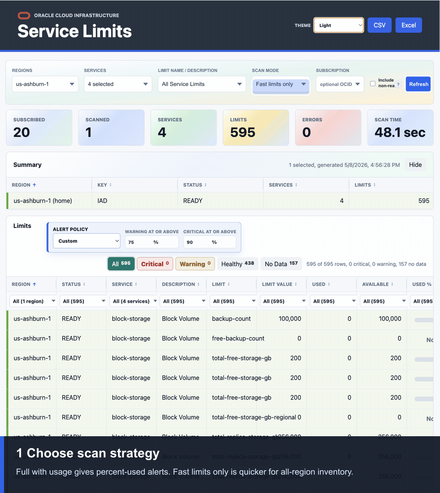
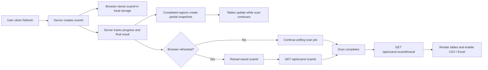

# OCI Service Limits Dashboard

Node.js and Express dashboard for scanning an Oracle Cloud Infrastructure tenancy, finding subscribed regions, and listing service limits, current usage, and percent used by region.

## Screenshot

Animated dashboard feature walkthrough showing scan mode selection, progressive table rendering, cache reuse, alert review, and exports:



## Latest Improvements

- Added all-region scan acceleration with progressive table rendering, region/service-level cache reuse, and a Fast limits only scan mode.
- Fast scans now skip usage enrichment for speed and can warm the full usage cache in the background for later full scans.
- Added a Facts for nerds panel with OCI SDK call counts, estimated payload sizes, latency, cache hits, usage lookups, errors, and the slowest call.
- Redesigned Facts for nerds as a compact telemetry board with an API pulse, metric tiles, slowest-call detail, and an operation mix chart.
- Added a hide/show toggle for the Facts for nerds telemetry board.
- File-backed scan persistence now labels restored reports as loaded from persistence in the dashboard status/footer.
- Browser refresh recovery keeps active scan progress and completed results available through server-owned scan sessions.
- Docker persistence guidance now includes host filesystem mounts, with a Kubernetes persistent volume note.
- README visuals now include an animated dashboard feature walkthrough at the top and a scan recovery flow diagram in the recovery section.

## Quick Start

```bash
git clone https://github.com/nafey1/OCI-Service-Limts.git
cd OCI-Service-Limts
cp .env.example .env
npm install
npm start
```

Open `http://localhost:3000`.

The default local auth path uses `~/.oci/config` with the `DEFAULT` profile. Edit `.env` if you need a different OCI profile, auth method, port, or default scan scope.

## Features

- Authenticates to OCI with config-file auth, instance principals, or resource principals.
- Reads subscribed OCI regions from the Identity API.
- Scans ready subscribed regions by default, with an optional Include non-ready control.
- Multi-select, searchable dropdown filters for regions, services, and limit name/description.
- Region and service dropdown summaries include counts where available.
- Home region is prioritized in the Regions filter.
- Scan Mode supports Full with usage or Fast limits only.
- Sortable Summary and Limits tables.
- Row-level multi-select filters in the Limits table.
- Region-coded rows with light table styling and resizable columns.
- Service name and service description are included in the Limits table.
- Limit status, usage, available capacity, and percent used are shown when OCI resource availability supports the limit.
- Warning and critical alert policies highlight high used-percent rows.
- Severity chips let users focus on critical, warning, healthy, or no-data rows.
- Live scan banner tracks region/service progress, active item, percentage, and elapsed time.
- Facts for nerds shows OCI SDK call counts, estimated data sent/retrieved, average and max latency, cache hits, usage lookups, API errors, and slowest call details.
- Partial scan results render as regions complete, instead of waiting for the full tenancy scan to finish.
- Region/service cache reuse reduces repeat scan time while the cache is fresh.
- Fast scans can trigger a background full scan to warm usage data for later full scans.
- Server-owned scan sessions let browser refreshes resume active scans and reload completed results.
- Optional file-backed scan persistence reloads completed scan reports after restart and labels them in the UI. Restored persisted scans show a top notice with generated time, saved time, row count, and a rescan action. The Summary header always shows the active data source: live scan, cache, restored session, or persistence.
- Summary cards reset while a rescan is running and show total scan time when complete.
- CSV and Excel downloads are enabled only after a completed scan and honor the latest criteria.
- Theme selector includes Pastels, Light, Dark, Ocean, Forest, and Sunset.
- Compact footer shows version, last scan context, OCI API source, profile, and auth method.

## Requirements

- Node.js 20 or newer.
- OCI SDK credentials through one of:
  - `~/.oci/config` and a profile.
  - Instance principal.
  - Resource principal.
- OCI IAM policy that allows the running principal to inspect limits and resource availability.

If Node.js is not installed on a Linux server, verify first:

```bash
node --version
npm --version
```

For Ubuntu or Debian servers, install Node.js 22.x with NodeSource:

```bash
sudo apt-get update
sudo apt-get install -y ca-certificates curl
curl -fsSL https://deb.nodesource.com/setup_22.x | sudo -E bash -
sudo apt-get install -y nodejs
node --version
npm --version
```

For Oracle Linux, RHEL, or other enterprise Linux distributions, install Node.js 20 or newer from your approved OS repository or NodeSource RPM repository, then verify `node --version` and `npm --version` before running the app.

## OCI Policy

The principal running this app needs tenancy-level permission to inspect limits/resource availability. A narrow starting point is:

```text
Allow group <group-name> to inspect resource-availability in tenancy
```

For dynamic groups, use the equivalent dynamic-group policy:

```text
Allow dynamic-group <dynamic-group-name> to inspect resource-availability in tenancy
```

Do not skip this. If IAM is wrong, the dashboard may authenticate successfully and still return empty or partial results.

## Local Run

```bash
cd OCI-Service-Limts
cp .env.example .env
npm install
npm start
```

Open `http://localhost:3000`.

Local runs bind to `127.0.0.1` by default. Set `HOST=0.0.0.0` only when you intentionally want the service reachable from outside the machine or container.

For local config-file auth, the app uses `~/.oci/config` and the `DEFAULT` OCI profile unless you override `OCI_CONFIG_FILE` or `OCI_PROFILE`. With config-file auth, the tenancy OCID is inferred from the selected OCI profile, so `OCI_TENANCY_OCID` is optional.

## Configuration

Copy `.env.example` to `.env` and adjust the values you need.

| Variable | Default | Purpose |
| --- | --- | --- |
| `PORT` | `3000` | HTTP port. |
| `HOST` | `127.0.0.1` | Bind address. |
| `OCI_AUTH_METHOD` | `config` | `config`, `instance_principal`, or `resource_principal`. |
| `OCI_CONFIG_FILE` | `~/.oci/config` | OCI config path for config-file auth. |
| `OCI_PROFILE` | `DEFAULT` | OCI config profile. |
| `OCI_TENANCY_OCID` | empty | Optional for config auth when tenancy can be inferred. |
| `OCI_LIMITS_COMPARTMENT_OCID` | tenancy OCID | Compartment used for limits queries. |
| `OCI_SUBSCRIPTION_OCID` | empty | Optional subscription OCID for subscription-specific limits. |
| `OCI_IDENTITY_REGION` | provider region or `us-ashburn-1` | Region used to read subscribed region metadata. |
| `DEFAULT_REGION_NAMES` | empty | Comma-separated default region filter. |
| `DEFAULT_SERVICE_NAMES` | empty | Comma-separated default service filter. |
| `DEFAULT_LIMIT_NAMES` | empty | Comma-separated default limit-name filter. |
| `DEFAULT_LIMIT_FILTER` | empty | Legacy text filter for limit name/description. |
| `DEFAULT_SCAN_MODE` | `full` | Default scan mode: `full` enriches usage, `fast` lists limits only. |
| `INCLUDE_NON_READY_REGIONS` | `false` | Include subscribed regions that are not `READY`. |
| `REGION_CONCURRENCY` | `3` | Number of regions scanned concurrently. |
| `SERVICE_CONCURRENCY` | `6` | Number of services scanned concurrently per region. |
| `RESOURCE_AVAILABILITY_CONCURRENCY` | `2` | Concurrent usage lookups. Keep this conservative. |
| `OCI_PAGE_SIZE` | `1000` | OCI list page size. |
| `CACHE_TTL_SECONDS` | `300` | In-memory report and region/service cache TTL. |
| `BACKGROUND_FULL_SCAN_ON_FAST` | `true` | After a fast scan, warm the full usage cache in the background. |
| `SCAN_STORE` | `memory` | Use `file` to persist completed scan jobs to disk. |
| `SCAN_DATA_DIR` | `data/scans` | Directory for persisted scan jobs when `SCAN_STORE=file`. |

## Dashboard Workflow

1. Select regions, services, and optional limit names/descriptions from the searchable multi-select filters.
2. Choose Full with usage when percent-used data is required, or Fast limits only when you need a quicker tenancy-wide inventory.
3. Optionally enter a subscription OCID.
4. Use Include non-ready only when you need regions that are still provisioning or otherwise not `READY`; those regions can return incomplete data or scan errors.
5. Click Refresh.
6. Watch the scan banner for progress by region/service, percentage, elapsed time, and cache reuse.
7. Review partial rows as regions complete; the tables do not wait for every subscribed region to finish.
8. If the browser is refreshed during a scan, the page resumes the server-side scan session and continues polling progress.
9. Use table filters, sorting, severity chips, and alert thresholds to narrow the Limits table.
10. Download CSV or Excel after the scan completes.

## All-Region Scan Performance

Tenancies subscribed to every OCI region can take a long time to scan because each region has its own service catalog, limit values, limit definitions, and optional resource availability calls. The app now uses a practical speed model instead of simply raising concurrency and risking OCI throttling.

- **Progressive rendering:** each completed region updates the Summary and Limits tables while the scan continues.
- **Region/service cache:** successful service scans are cached by tenancy, compartment, subscription, region, service, limit filters, and scan mode for `CACHE_TTL_SECONDS`.
- **Fast limits only mode:** skips usage/resource availability calls and returns the limit inventory faster. Supported usage rows show `Deferred` in the Usage column.
- **Background full cache warming:** when `BACKGROUND_FULL_SCAN_ON_FAST=true`, a completed fast scan starts a detached full usage scan for the same criteria. Later full scans can reuse the warmed cache.
- **Full with usage mode:** keeps the previous behavior and calculates used, available, effective limit, and percent used when OCI resource availability supports the limit.

For very large tenancies, use Fast limits only for broad exploration, then switch to Full with usage for the regions or services that need alert review. The cache keeps repeat scans from starting over while it is still fresh.

The Facts for nerds panel reports exact SDK operation counts and measured app-side latency. Data sent and data retrieved are application-payload estimates based on the request and response objects handled by the app; they are not exact wire-level network byte counts.

## Scan Sessions and Refresh Recovery

Dashboard scans are server-owned jobs. When a scan starts, the server creates a `scanId` and stores progress, status, errors, and the completed report in memory. The browser stores the active `scanId` in local storage.

If the browser is refreshed during a scan:

- the page reloads the saved `scanId`
- the UI asks the server for the scan job
- progress polling resumes from the server-side state
- any available partial result is rendered again
- when the scan completes, the table reloads from `/api/scans/:scanId/result`

If the browser is refreshed after a scan completes, the dashboard reloads the completed result and enables CSV/Excel downloads from the scan-owned download endpoints.

This recovery is intentionally in-memory. It survives browser refreshes, but not a Node.js process restart. Restarting the server clears active scan jobs and completed scan-session results.



## API

### `POST /api/scans`

Starts a server-owned scan job and returns a `scanId`. The browser stores this id so refreshes can resume active scans or reload completed results.

Accepts the same scan query parameters as `/api/limits`, plus optional `scanId`.

### `GET /api/scans/:scanId`

Returns scan status, progress, criteria summary, and completion/error metadata.

### `GET /api/scans/latest`

Returns the latest active or completed scan job. When `SCAN_STORE=file`, completed persisted jobs can also be reloaded from disk.

### `GET /api/scans/:scanId/result`

Returns the completed scan report. If the scan is still running and partial region results are available, the endpoint returns `206` with `partial: true`. If no partial result is available yet, it returns `202` with scan metadata.

Completed and partial reports include a `telemetry` object with SDK call counts, estimated request/response bytes, operation latency, API error count, operation summaries, and slowest-call detail. Persisted scan responses also include `storage: "file"` and `loadedFromPersistence: true`.

### `GET /api/scans/:scanId/limits.csv`

Downloads the completed scan result as CSV.

### `GET /api/scans/:scanId/limits.xlsx`

Downloads the completed scan result as an Excel workbook.

### `GET /api/limits`

Scans or returns cached service-limit data directly. This endpoint remains available for direct API use, but the browser dashboard uses `/api/scans` so progress and results survive browser refreshes.

Query parameters:

- `regions`: optional comma-separated region names or region keys, for example `us-ashburn-1,eu-frankfurt-1`
- `services`: optional comma-separated OCI Limits service names, for example `compute,block-storage`
- `limitNames`: optional comma-separated limit names selected from the Limit Name / Description dropdown
- `limitFilter`: optional legacy text matched against limit name and limit description
- `scanMode`: optional `full` or `fast`; `full` enriches usage, `fast` lists limits only
- `includeNonReadyRegions`: optional boolean, defaults to `false`
- `compartmentId`: optional compartment OCID, defaults to `OCI_LIMITS_COMPARTMENT_OCID` or tenancy OCID
- `subscriptionId`: optional subscription OCID for subscription-specific limits
- `tenantId`: optional tenancy OCID override
- `refresh`: optional boolean to bypass the in-memory cache
- `scanId`: optional client-generated id used for progress tracking

Example:

```bash
curl "http://localhost:3000/api/limits?services=compute&regions=us-ashburn-1&refresh=true"
```

### `GET /api/progress/:scanId`

Returns app-level progress for an active or recently completed scan.

Progress is approximate because OCI does not expose internal per-request progress. The app reports the work it can measure: regions selected/completed, services discovered/completed, active region/service, rows, errors, percent, and status.

### `GET /api/limits.csv`

Same query parameters as `/api/limits`, returned as CSV.

### `GET /api/limits.xlsx`

Same query parameters as `/api/limits`, returned as an Excel workbook.

### `GET /api/defaults`

Returns dashboard defaults and auth context.

### `GET /api/options/regions`

Returns subscribed regions for the region multi-select.

### `GET /api/options/services`

Returns service names for the service multi-select. The endpoint honors selected regions and optional subscription OCID.

### `GET /api/options/limits`

Returns limit name/description options for the limit multi-select. The endpoint honors selected regions, services, and optional subscription OCID.

### `GET /healthz`

Health check endpoint.

## Docker Run

```bash
docker build -t oci-service-limits-dashboard .
docker run --rm -p 3000:3000 \
  -e OCI_AUTH_METHOD=config \
  -e OCI_CONFIG_FILE=/home/node/.oci/config \
  -e OCI_PROFILE=DEFAULT \
  -v "$HOME/.oci:/home/node/.oci:ro" \
  oci-service-limits-dashboard
```

For OCI-hosted deployment, use `OCI_AUTH_METHOD=instance_principal` or `OCI_AUTH_METHOD=resource_principal` and avoid mounting an API key.

### Host Filesystem Mount for Docker Persistence

By default, the dashboard keeps active scan sessions in memory. A browser refresh can recover the scan while the server is still running, but a container restart clears in-memory scan jobs. For Docker deployments that need completed scan results to survive container restarts, set `SCAN_STORE=file`, mount a host filesystem path, and point `SCAN_DATA_DIR` at the mounted directory.

When a completed scan result is loaded from file-backed persistence, the dashboard status and footer explicitly show that it was **loaded from persistence**.

Example host directory:

```bash
sudo mkdir -p /opt/oci-service-limits/data
sudo chown "$(id -u):$(id -g)" /opt/oci-service-limits/data
```

Example container run:

```bash
docker run --rm -p 3000:3000 \
  -e OCI_AUTH_METHOD=config \
  -e OCI_CONFIG_FILE=/home/node/.oci/config \
  -e OCI_PROFILE=DEFAULT \
  -e SCAN_STORE=file \
  -e SCAN_DATA_DIR=/app/data/scans \
  -v /opt/oci-service-limits/data:/app/data \
  -v "$HOME/.oci:/home/node/.oci:ro" \
  oci-service-limits-dashboard
```

With that mount, files written under `/app/data` in the container are stored under `/opt/oci-service-limits/data` on the host. This model is appropriate for one container on one Docker host. For multiple containers, use a shared external store instead of independent local files.

Kubernetes deployments should use a PersistentVolume and PersistentVolumeClaim for the scan data directory if scan-session persistence must survive pod restarts or rescheduling. Use an access mode and storage backend that matches the deployment model; multiple replicas need storage semantics that safely support concurrent access.

## Development

```bash
npm run check
npm test
```

## Operational Notes

- Keep OCI private keys and `.env` out of Git. This repository includes `.gitignore` and `.dockerignore` for that reason.
- A full scan is roughly region count multiplied by service count, plus resource-availability calls for supported limits.
- Tune `REGION_CONCURRENCY`, `SERVICE_CONCURRENCY`, and `RESOURCE_AVAILABILITY_CONCURRENCY` carefully. Increasing them blindly can trigger throttling.
- Use `DEFAULT_SERVICE_NAMES` when you want a focused dashboard instead of a broad tenancy scan every refresh.
- Use Fast limits only for broad all-region inventory, then Full with usage for alert analysis.
- CSV and Excel downloads use the last completed scan criteria. If the filters change, run Refresh again before downloading.
- Server-owned scan sessions are held in memory for browser refresh recovery. They survive page reloads, but not a Node.js process restart.

## Repository Update History

- Added file-backed completed-scan persistence metadata and dashboard labeling when a report is loaded from persistence.
- Added a visible Summary data-source badge so persistence, cache, restored-session, and live-scan sources are clear.
- Added a top restored-persistence notice with generated/saved timestamps, row count, and a Refresh OCI action.
- Redesigned the Facts for nerds display into a more visual telemetry board with operation mix bars.
- Added a hide/show control to collapse or expand the Facts for nerds telemetry board.
- Added scan telemetry and a Facts for nerds UI panel for OCI API calls, estimated payload sizes, latency, cache hits, usage lookups, errors, and slowest-call detail.
- Updated the animated README GIF to highlight scan mode selection, progressive table rendering, cache reuse, alert review, and exports.
- Added all-region scan acceleration with progressive table rendering, Fast limits only mode, Full with usage mode, region/service-level cache reuse, and background full-cache warming.
- Moved the animated scan recovery demo to the top Screenshot section.
- Added an animated scan recovery GIF and a Mermaid flow diagram for scan-session recovery.
- Documented Docker host filesystem persistence mounts and Kubernetes PersistentVolume/PersistentVolumeClaim guidance.
- Documented scan refresh recovery behavior and its in-memory limitation.
- Implemented server-owned scan sessions so browser refreshes can resume active scans and reload completed results.
- Added Linux server Node.js installation guidance under Requirements.
- Added README Quick Start and clarified the local run directory.
- Added repository `AGENTS.md` instructions for future development agents.
- Added a real dashboard screenshot showing filters, summary cards, alert policy, severity chips, row filters, and scan results.
- Built the initial Node.js and Express OCI Service Limits dashboard with OCI auth, subscribed-region discovery, multi-select filters, sortable tables, usage enrichment, alert policy controls, themes, and CSV/Excel downloads.
- Created the initial repository scaffold.
