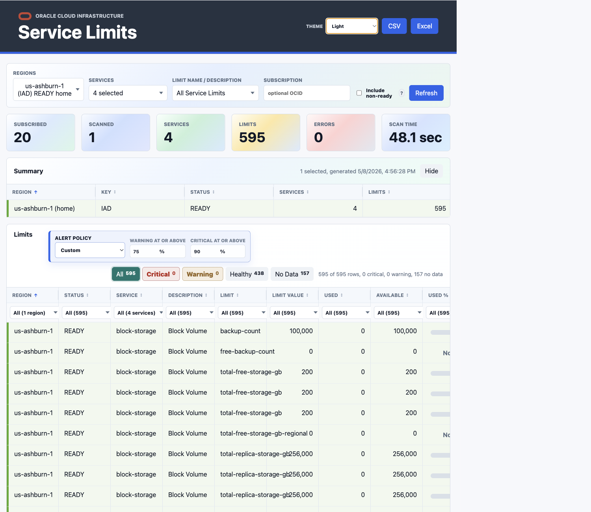

# OCI Service Limits Dashboard

Node.js and Express dashboard for scanning an Oracle Cloud Infrastructure tenancy, finding subscribed regions, and listing service limits, current usage, and percent used by region.

## Screenshot

Real scan output from a focused run against `us-ashburn-1` with Compute, Block Volume, Object Storage, and VCN selected:



## Features

- Authenticates to OCI with config-file auth, instance principals, or resource principals.
- Reads subscribed OCI regions from the Identity API.
- Scans ready subscribed regions by default, with an optional Include non-ready control.
- Multi-select, searchable dropdown filters for regions, services, and limit name/description.
- Region and service dropdown summaries include counts where available.
- Home region is prioritized in the Regions filter.
- Sortable Summary and Limits tables.
- Row-level multi-select filters in the Limits table.
- Region-coded rows with light table styling and resizable columns.
- Service name and service description are included in the Limits table.
- Limit status, usage, available capacity, and percent used are shown when OCI resource availability supports the limit.
- Warning and critical alert policies highlight high used-percent rows.
- Severity chips let users focus on critical, warning, healthy, or no-data rows.
- Live scan banner tracks region/service progress, active item, percentage, and elapsed time.
- Summary cards reset while a rescan is running and show total scan time when complete.
- CSV and Excel downloads are enabled only after a completed scan and honor the latest criteria.
- Theme selector includes Pastels, Light, Dark, Ocean, Forest, and Sunset.
- Compact footer shows version, last scan context, OCI API source, profile, and auth method.

## Requirements

- Node.js 20 or newer.
- OCI SDK credentials through one of:
  - `~/.oci/config` and a profile.
  - Instance principal.
  - Resource principal.
- OCI IAM policy that allows the running principal to inspect limits and resource availability.

## OCI Policy

The principal running this app needs tenancy-level permission to inspect limits/resource availability. A narrow starting point is:

```text
Allow group <group-name> to inspect resource-availability in tenancy
```

For dynamic groups, use the equivalent dynamic-group policy:

```text
Allow dynamic-group <dynamic-group-name> to inspect resource-availability in tenancy
```

Do not skip this. If IAM is wrong, the dashboard may authenticate successfully and still return empty or partial results.

## Local Run

```bash
cd OCI-Service-Limts
cp .env.example .env
npm install
npm start
```

Open `http://localhost:3000`.

Local runs bind to `127.0.0.1` by default. Set `HOST=0.0.0.0` only when you intentionally want the service reachable from outside the machine or container.

For local config-file auth, the app uses `~/.oci/config` and the `DEFAULT` OCI profile unless you override `OCI_CONFIG_FILE` or `OCI_PROFILE`. With config-file auth, the tenancy OCID is inferred from the selected OCI profile, so `OCI_TENANCY_OCID` is optional.

## Configuration

Copy `.env.example` to `.env` and adjust the values you need.

| Variable | Default | Purpose |
| --- | --- | --- |
| `PORT` | `3000` | HTTP port. |
| `HOST` | `127.0.0.1` | Bind address. |
| `OCI_AUTH_METHOD` | `config` | `config`, `instance_principal`, or `resource_principal`. |
| `OCI_CONFIG_FILE` | `~/.oci/config` | OCI config path for config-file auth. |
| `OCI_PROFILE` | `DEFAULT` | OCI config profile. |
| `OCI_TENANCY_OCID` | empty | Optional for config auth when tenancy can be inferred. |
| `OCI_LIMITS_COMPARTMENT_OCID` | tenancy OCID | Compartment used for limits queries. |
| `OCI_SUBSCRIPTION_OCID` | empty | Optional subscription OCID for subscription-specific limits. |
| `OCI_IDENTITY_REGION` | provider region or `us-ashburn-1` | Region used to read subscribed region metadata. |
| `DEFAULT_REGION_NAMES` | empty | Comma-separated default region filter. |
| `DEFAULT_SERVICE_NAMES` | empty | Comma-separated default service filter. |
| `DEFAULT_LIMIT_NAMES` | empty | Comma-separated default limit-name filter. |
| `DEFAULT_LIMIT_FILTER` | empty | Legacy text filter for limit name/description. |
| `INCLUDE_NON_READY_REGIONS` | `false` | Include subscribed regions that are not `READY`. |
| `REGION_CONCURRENCY` | `3` | Number of regions scanned concurrently. |
| `SERVICE_CONCURRENCY` | `6` | Number of services scanned concurrently per region. |
| `RESOURCE_AVAILABILITY_CONCURRENCY` | `2` | Concurrent usage lookups. Keep this conservative. |
| `OCI_PAGE_SIZE` | `1000` | OCI list page size. |
| `CACHE_TTL_SECONDS` | `300` | In-memory report cache TTL. |

## Dashboard Workflow

1. Select regions, services, and optional limit names/descriptions from the searchable multi-select filters.
2. Optionally enter a subscription OCID.
3. Use Include non-ready only when you need regions that are still provisioning or otherwise not `READY`; those regions can return incomplete data or scan errors.
4. Click Refresh.
5. Watch the scan banner for progress by region/service, percentage, and elapsed time.
6. Use table filters, sorting, severity chips, and alert thresholds to narrow the Limits table.
7. Download CSV or Excel after the scan completes.

## API

### `GET /api/limits`

Scans or returns cached service-limit data.

Query parameters:

- `regions`: optional comma-separated region names or region keys, for example `us-ashburn-1,eu-frankfurt-1`
- `services`: optional comma-separated OCI Limits service names, for example `compute,block-storage`
- `limitNames`: optional comma-separated limit names selected from the Limit Name / Description dropdown
- `limitFilter`: optional legacy text matched against limit name and limit description
- `includeNonReadyRegions`: optional boolean, defaults to `false`
- `compartmentId`: optional compartment OCID, defaults to `OCI_LIMITS_COMPARTMENT_OCID` or tenancy OCID
- `subscriptionId`: optional subscription OCID for subscription-specific limits
- `tenantId`: optional tenancy OCID override
- `refresh`: optional boolean to bypass the in-memory cache
- `scanId`: optional client-generated id used by `/api/progress/:scanId`

Example:

```bash
curl "http://localhost:3000/api/limits?services=compute&regions=us-ashburn-1&refresh=true"
```

### `GET /api/progress/:scanId`

Returns app-level progress for an active or recently completed scan.

Progress is approximate because OCI does not expose internal per-request progress. The app reports the work it can measure: regions selected/completed, services discovered/completed, active region/service, rows, errors, percent, and status.

### `GET /api/limits.csv`

Same query parameters as `/api/limits`, returned as CSV.

### `GET /api/limits.xlsx`

Same query parameters as `/api/limits`, returned as an Excel workbook.

### `GET /api/defaults`

Returns dashboard defaults and auth context.

### `GET /api/options/regions`

Returns subscribed regions for the region multi-select.

### `GET /api/options/services`

Returns service names for the service multi-select. The endpoint honors selected regions and optional subscription OCID.

### `GET /api/options/limits`

Returns limit name/description options for the limit multi-select. The endpoint honors selected regions, services, and optional subscription OCID.

### `GET /healthz`

Health check endpoint.

## Docker Run

```bash
docker build -t oci-service-limits-dashboard .
docker run --rm -p 3000:3000 \
  -e OCI_AUTH_METHOD=config \
  -e OCI_CONFIG_FILE=/home/node/.oci/config \
  -e OCI_PROFILE=DEFAULT \
  -v "$HOME/.oci:/home/node/.oci:ro" \
  oci-service-limits-dashboard
```

For OCI-hosted deployment, use `OCI_AUTH_METHOD=instance_principal` or `OCI_AUTH_METHOD=resource_principal` and avoid mounting an API key.

## Development

```bash
npm run check
npm test
```

## Operational Notes

- Keep OCI private keys and `.env` out of Git. This repository includes `.gitignore` and `.dockerignore` for that reason.
- A full scan is roughly region count multiplied by service count, plus resource-availability calls for supported limits.
- Tune `REGION_CONCURRENCY`, `SERVICE_CONCURRENCY`, and `RESOURCE_AVAILABILITY_CONCURRENCY` carefully. Increasing them blindly can trigger throttling.
- Use `DEFAULT_SERVICE_NAMES` when you want a focused dashboard instead of a broad tenancy scan every refresh.
- CSV and Excel downloads use the last completed scan criteria. If the filters change, run Refresh again before downloading.
